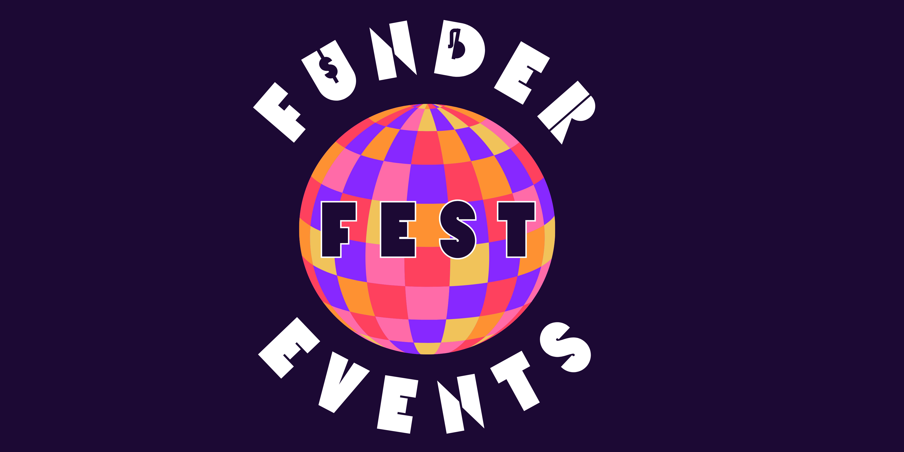
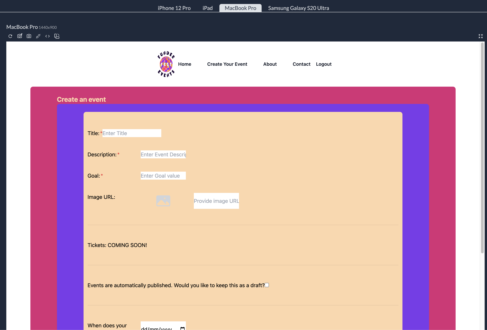
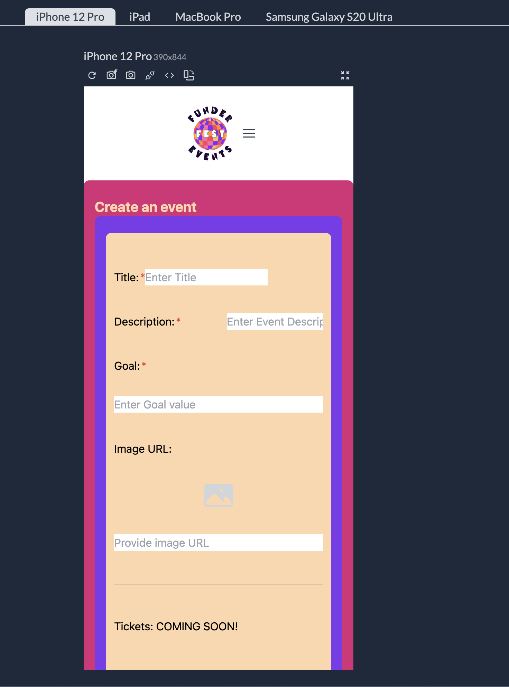
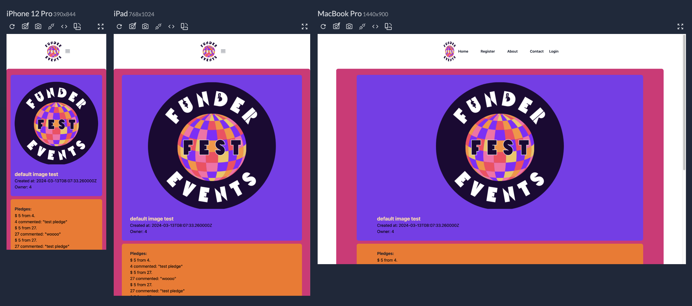
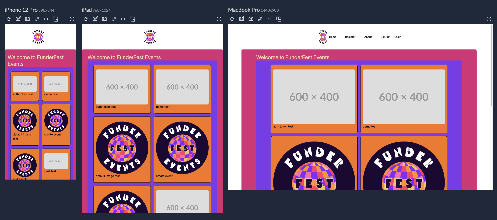
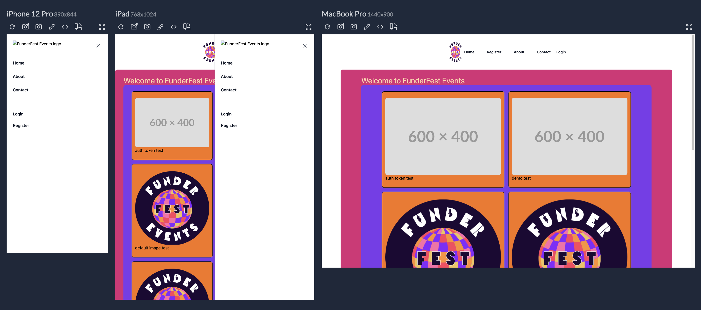

# FunderFest Events Front End

Front end repo for She Codes crowdfunding project.

        

[](https://opensource.org/licenses/MIT)

---

[About](#about) ✦ [Future Developments](#future-developments) ✦ [Resources](#resources) ✦ [License](#license) ✦ [Contact](#contact)

---

## About

https://main--frabjous-licorice-33173c.netlify.app/

### What is FunderFest?

This project aim was to create a crowdfunding website. I decided to work with my events and festival background and create a platform for event creators. Funderfest Events allows event creators to sell tickets to their event with the oportunity to get donations for the event as well.

### Intended Audience/User Stories

```md
AS AN event planner
I WANT a platform that allows people to purchase tickets to support my event
SO THAT I have the funding to progress with my event
```

## Demo Images











## Future Developments

## Resources

https://www.geeksforgeeks.org/how-to-show-and-hide-password-in-reactjs/

## License

This project is using the following license:

**MIT**

For further information regarding the license, please follow the link below:
https://opensource.org/licenses/MIT

---

## Contact

If you have any further questions, please contact via email or github.

<a href="mailto:caoimhejyoti@gmail.com"></a> <a href="https://github.com/caoimhejyoti"></a>
